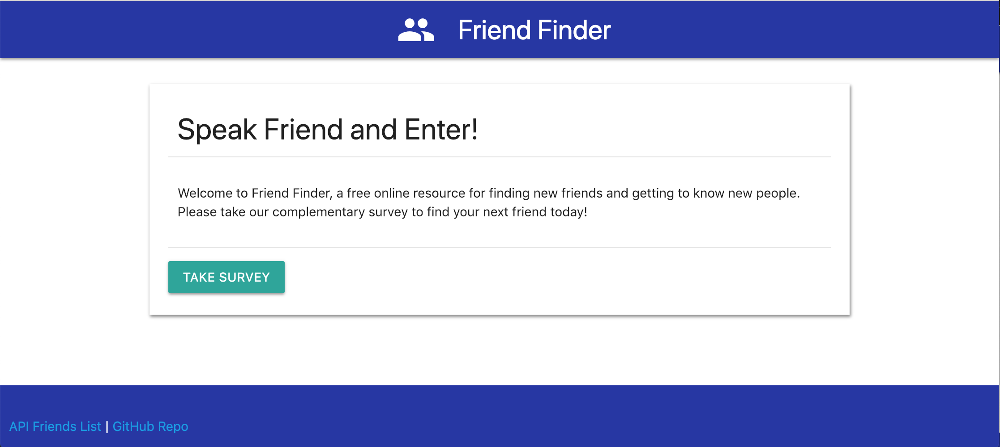
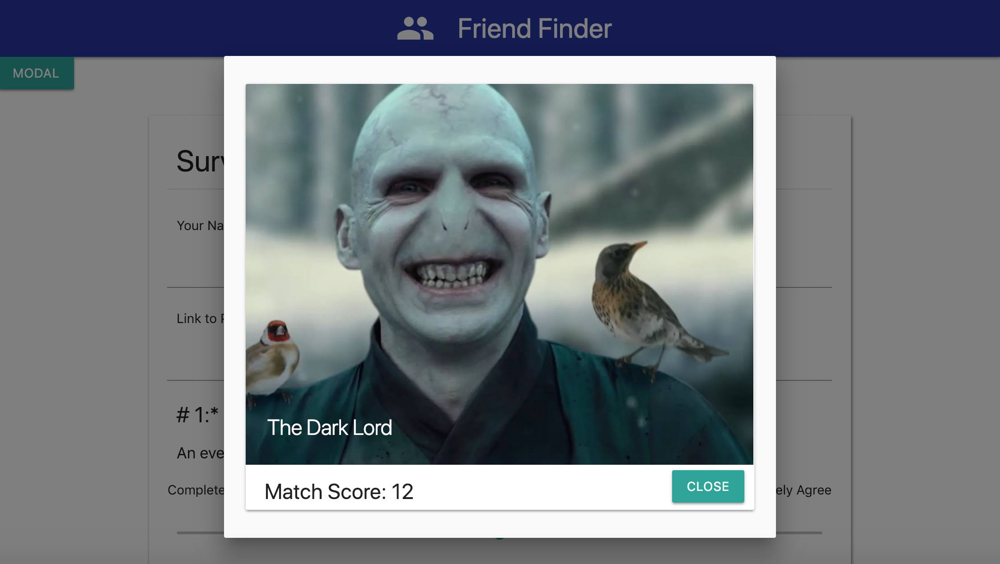
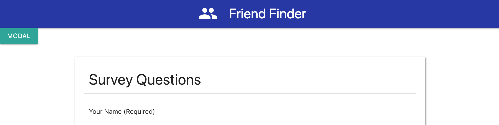

# Friend Finder - Node and Express Servers

[Demo on Heroku](https://damp-headland-89517.herokuapp.com/)

### Introduction

The objective of this project was to build a compatibility-based "FriendFinder" application -- basically a dating app with a middle-earth twist. This full-stack web-application takes user submitted survey information, saves it to the server, and compares the user's answers with those from previous users to help find a match. The lower the match score, the less differences in answers between the two people and the app will then display the name and picture of their ideal friend.

- - -

### Instructions

There are really only two main functions of the app

1. Take the survey to find a friend!

2. View the api list of all possible friends saved so far.

- - -

### Technology Used:

  * [node.js](https://nodejs.org/en/) - for Javascript based server code and logic
  * [express](https://expressjs.com/) - companion Web Framework for node.js
  * [path](https://nodejs.org/api/path.html) - for establishing api routes and filepaths
  * [jQuery](https://jquery.com/) - for a few Javascript shortcuts
  * [materalizecss](https://materializecss.com/) - for a UI and Design starting point
  * [Heroku](https://www.heroku.com/) - for app deployment and hosting
  * Custom Javascript, HTML, and CSS - for everything else!

### Overview

1. This application uses an online form to capture the following user input:

    * The User's Name
    * A URL to an image of the user
    * 10 survey questions that are rated from 1 (completely disagree) to 5 (completely agree) respectively

2. Once submitted, the system uses custom Javascript functions to evaluate the current submission with existing friend entries to find a match. This is done by saving each user's results in an array like this:
  * Example:
       * User 1: `[5, 1, 4, 4, 5, 1, 2, 5, 4, 1]`
       * User 2: `[3, 2, 6, 4, 5, 1, 2, 5, 4, 1]`
       * Total Difference: **2 + 1 + 2 =** **_5_**
   * The solution only uses the absolute value of the differences. Therefore, both `5-3` and `3-5` will = `2`, and so on.
   * The closest match will be the user with the least amount of difference (ie the lowest Match Score).

3. With the best match found the form values then get saved to the `friends.js` data file

4. Then the app returns to the survey layout to clear the form data, and update the hidden modal card window with the survey match results.

5. Once a friend has been the user simply needs to click on the modal button* to display the result as a modal pop-up containing their new buddy's name, picture, and match score.

- - -

### Future Development*

As a challenge, I decided to use the MateralizeCSS framework for the UI Design but found that their current modal window functionality is sorely lacking and underdocumented. Due to this users have to manually trigger the modal window themselves to see their match -which is NOT ideal.

If necessary I may have to re-do the project using something like Bootstrap but this at least proves concept for now.

